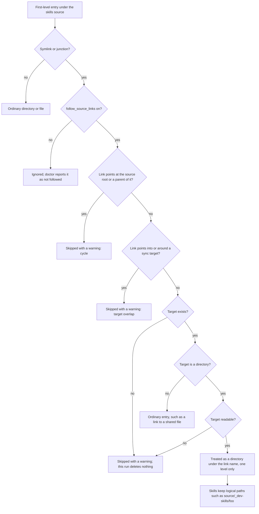

# Configuration

Configuration file reference for skillshare.

## Overview

```text
~/.config/skillshare/
├── config.yaml          ← Configuration file
├── skills/              ← Source directory (your skills)
│   ├── .metadata.json   ← Skill metadata (auto-managed)
│   ├── my-skill/
│   ├── another/
│   └── _team-repo/      ← Tracked repository
├── extras/              ← Extras source root
│   └── rules/           ← Extra resource (e.g., rules)

~/.local/share/skillshare/
└── backups/             ← Automatic backups
    └── 2026-01-20.../
```

---

## IDE Support (JSON Schema) {#ide-support}

Config files include a YAML Language Server directive that enables **autocompletion**, **validation**, and **hover documentation** in supported editors.

New configs created by `skillshare init` include this automatically:

```yaml
# yaml-language-server: $schema=https://raw.githubusercontent.com/runkids/skillshare/main/schemas/config.schema.json
source: ~/.config/skillshare/skills
targets:
  claude:
    path: ~/.claude/skills
```

### Adding to an existing config

If your config was created before this feature, add the comment as the **first line**:

**Global config** (`~/.config/skillshare/config.yaml`):
```yaml
# yaml-language-server: $schema=https://raw.githubusercontent.com/runkids/skillshare/main/schemas/config.schema.json
```

**Project config** (`.skillshare/config.yaml`):
```yaml
# yaml-language-server: $schema=https://raw.githubusercontent.com/runkids/skillshare/main/schemas/project-config.schema.json
```

Or simply re-run `skillshare init --force` (global) or `skillshare init -p --force` (project) to regenerate the config with the schema comment.

### Supported editors

| Editor | Extension required |
|--------|-------------------|
| VS Code | [YAML](https://marketplace.visualstudio.com/items?itemName=redhat.vscode-yaml) by Red Hat |
| JetBrains IDEs | Built-in YAML support |
| Neovim | [yaml-language-server](https://github.com/redhat-developer/yaml-language-server) via LSP |

---

## Config File

**Location:** `~/.config/skillshare/config.yaml`

### Full Example

```yaml
# yaml-language-server: $schema=https://raw.githubusercontent.com/runkids/skillshare/main/schemas/config.schema.json
# Source directory (where you edit skills)
source: ~/.config/skillshare/skills

# Follow directory links directly under the skills source (opt-in)
# follow_source_links: true

# Default sync mode for new targets
mode: merge

# Default target naming (flat or standard)
# target_naming: flat

# Targets (AI CLI skill directories)
targets:
  claude:
    path: ~/.claude/skills
    # mode: merge (inherits from default)

  codex:
    path: ~/.codex/skills
    mode: symlink  # Override default mode
    include: [codex-*] # merge/copy mode only

  cursor:
    path: ~/.cursor/skills
    mode: copy  # real files for Cursor
    exclude: [experimental-*] # merge/copy mode only

  # Custom target
  myapp:
    path: ~/apps/myapp/skills

# Remote skills — auto-managed by install/uninstall
skills:
  - name: pdf
    source: anthropics/skills/skills/pdf
  - name: _team-skills
    source: github.com/team/skills
    tracked: true

# Fold $HOME → ~ on save (dotfiles-friendly)
# preserve_tilde_on_save: true

# Directory for commit/push/pull (skills default, agents, extras, root)
# git_root: skills

# Custom agents source (optional, overrides default location)
agents_source: ~/my-agents

# Custom extras source (optional, overrides default location)
extras_source: ~/my-extras

# Non-skill resources to sync
extras:
  - name: rules
    source: ~/company-shared/rules   # optional per-extra override
    targets:
      - path: ~/.claude/rules
      - path: ~/.cursor/rules
        mode: copy

# Files to ignore during sync
ignore:
  - "**/.DS_Store"
  - "**/.git/**"
  - "**/node_modules/**"
  - "**/*.log"
```

---

## Fields

### `source`

Path to your skills directory (single source of truth).

```yaml
source: ~/.config/skillshare/skills
```

**Default:** `~/.config/skillshare/skills`

### `follow_source_links` {#follow_source_links}

Opt in to discovering skills through a symlink (Unix) or junction (Windows) placed directly under the skills source.

| Field | Type | Default | Scope |
|-------|------|---------|-------|
| `follow_source_links` | boolean | `false` | Global and project config |

```yaml title="~/.config/skillshare/config.yaml"
follow_source_links: true
```

With the default `false`, discovery ignores first-level links and `skillshare doctor` reports them as not followed. With `true`, a first-level link to a directory is treated as that directory under its link name. Links deeper inside the tree are not followed for discovery. This setting is separate from linking the source root itself, which is already supported without opting in.

For example, link an existing checkout into the source with [`skillshare link`](../commands/link.md):

```bash
skillshare link ~/code/dev-skills --enable
skillshare sync
```

This creates `~/.config/skillshare/skills/_dev-skills` and, with `--enable`, sets `follow_source_links: true`. The command refuses a target the safety guards below would skip, and [`skillshare unlink _dev-skills`](../commands/unlink.md) removes the link again.

:::note Manual links
A link you create yourself (`ln -s ~/code/dev-skills ~/.config/skillshare/skills/_dev-skills`) is followed the same way; the guards are then only reported by `skillshare doctor` after the fact.
:::

If `~/code/dev-skills` contains a `.git` entry, `_dev-skills` becomes a tracked-repo group and its children are discovered as skills. Sync links or copies them like any other skill. In symlink mode, editing files in the real checkout is visible immediately in targets; copy mode requires another sync.

Git worktrees and submodules with a `.git` file are also checkouts: `update --all` skips them, and the dashboard refuses to update them.

:::warning Updates change the real checkout
`skillshare update _dev-skills` runs git inside `~/code/dev-skills`, not a separate managed clone. `skillshare update _dev-skills --force` resets that real checkout and discards its local changes. `skillshare update --all` skips followed links with a warning for that reason, including with `--force`; update them by name. `skillshare install <url> --track --update` refuses to pull a followed checkout with uncommitted changes, because a blocking audit finding could roll it back with `git reset --hard`; commit or stash first. The dashboard never updates followed Git checkouts, including force retries; they are managed by you.
:::

#### Safety guards

- A link pointing at the source root or one of its ancestors is skipped.
- A link overlapping a sync target is skipped. This is decided from the link text, so it also applies when the target directory does not exist yet.
- A link whose target is missing or unreadable is skipped with a warning. A read failure while traversing the target or any of its subdirectories also marks the link as unavailable, even if discovery has already returned some skills. That run performs **no pruning, orphan-copy deletion, or metadata deletion**. An unmounted external drive is safe: remount it and run sync again. `skillshare doctor` lists the dangling target links behind that source link as waiting for it, not as broken links to prune. This classification uses the stored link destination, so it also works with `target_naming: standard`.
- A link to a file (a shared `.skillignore`, say) is not a directory link. It stays an ordinary entry and never affects pruning.

#### How discovery decides

Every command that reads the source (`list`, `sync`, `update`, `status`, the dashboard) walks it through one shared walker. For each first-level entry it decides as follows:



#### Skills on an external drive

Keep a checkout on an external drive and link it into the source:

```bash
skillshare link /Volumes/Work/dev-skills --enable
skillshare sync
```

While the drive is mounted, `_dev-skills` behaves like any other tracked-repo group. When it is not mounted:

- `list`, `sync`, `status`, `update --all`, `audit`, and the dashboard skip the link and print one warning naming it. `sync --json` lists it under `warnings`; `audit --format json` lists it under `warnings` and sets `incomplete: true`, so automation can tell a partial run from a complete one.
- That run makes **no deletions**: target links and copies that came from the drive stay in place, orphan copies are not cleaned up, and install metadata for its skills is kept, because an unavailable link means the inventory is incomplete, not that the skills were removed.
- In symlink mode, the target links point at the unmounted path, so the AI tools cannot read those skills until the drive is back. In copy mode, the copies keep working.
- `skillshare doctor` shows those target links as waiting for the source link, as a warning, and does not suggest pruning them.
- Nothing has to be re-registered: mount the drive and run `skillshare sync` again.

The mount path must stay the same between sessions. On macOS that is `/Volumes/<name>`, so keep the volume name fixed. On Windows, a drive letter that changes between plugs leaves the junction pointing at the wrong place; assign a fixed letter in Disk Management or use a mounted folder path instead.

#### Writes through the link

Writes to a skill behind the link land in the real checkout: editing content in the dashboard, `skillshare install --into _dev-skills`, and replacing a regular skill inside the linked directory all change `~/code/dev-skills`. `skillshare uninstall _dev-skills/<child>` moves that child from the real checkout to the trash. `skillshare unlink _dev-skills` removes the link entry only, never the real checkout; the trash lists the link and `restore` recreates it. `skillshare trash restore _dev-skills/<child>` puts the child back in the real checkout under the same policy, and a nested link below the checkout that leads elsewhere makes the restore fail while the trash entry is kept. Paths that would escape the checkout (`..`, or a nested link leading outside it) are still refused.

This also applies when `SKILL.md` is at the linked folder’s root, where `uninstall` is refused. Use the dashboard **Unlink** action or `skillshare unlink _dev-skills` to remove the link without changing its target.

When dashboard target assignment writes frontmatter, it also uses this boundary: a nested `SKILL.md` link is refused without changing its target. Batch assignment reports the refusal for that skill and continues with regular skills.

Replacing a skill behind a followed link keeps the old skill until the replacement succeeds; a copy failure restores it. Links in incoming staged content are copied as real files or directories, and dangling links are skipped.

When moving a skill to trash across filesystems, nested file and directory links are preserved as links with their original target text; their targets are never copied or deleted. On Windows a junction stays a junction, so no Developer Mode is needed.

`--group` accepts the link name for `update` and `check` (`skillshare update --group _dev-skills`). A group nested below the link, such as `_dev-skills/sub`, is not accepted by `--group`; name its skills instead. `skillshare uninstall --group _dev-skills` is refused because it would empty the real checkout: use `skillshare unlink _dev-skills` for the link, or name the skills to trash.

On Unix, committing the source repo stages the link entry itself, that is its target text, which is usually a machine-local absolute path, not the checkout's files. Add `/_dev-skills` to the skills directory's `.gitignore`. `skillshare commit`, `push`, and `init` print a warning when a link would be staged.

#### Windows

Directory junctions are the intended mechanism. `skillshare link D:\code\dev-skills` creates one, which needs no Developer Mode or elevation, and falls back to a directory symlink only when the junction cannot be made. To create the junction by hand instead:

```powershell
cmd /c mklink /J "%APPDATA%\skillshare\skills\_dev-skills" "D:\code\dev-skills"
```

The drive letter must stay stable. Verified on Windows 11 ARM64 with `ai_docs/tests/windows_follow_source_links_runbook.md`.

### `mode`

Default sync mode for all targets.

```yaml
mode: merge
```

| Value | Behavior |
|-------|----------|
| `merge` | Each skill symlinked individually. Local skills preserved. **(default)** |
| `copy` | Each skill copied as real files. For AI CLIs that can't follow symlinks. |
| `symlink` | Entire target directory is one symlink. |

### `target_naming`

Default target naming strategy for merge/copy sync.

```yaml
target_naming: flat
```

| Value | Behavior |
|-------|----------|
| `flat` | Nested skills flattened with `__` separators (e.g. `frontend__dev`). **(default)** |
| `standard` | Uses the SKILL.md `name` field directly (e.g. `dev`). Follows the [Agent Skills spec](https://agentskills.io/specification). |

`include` / `exclude` keep matching the flat name (`frontend__dev`) in both modes, so under `standard` the filter differs from the folder `sync` creates — see [include / exclude](#include--exclude-target-filters).

### `targets`

AI CLI skill directories to sync to.

```yaml
targets:
  <name>:
    path: <path>
    mode: <mode>  # optional, overrides default
    include: [<glob>, ...]  # optional, merge/copy mode only
    exclude: [<glob>, ...]  # optional, merge/copy mode only
```

**Example:**
```yaml
targets:
  claude:
    path: ~/.claude/skills

  codex:
    path: ~/.codex/skills
    mode: symlink

  custom:
    path: ~/my-app/skills
```

#### Another account of an Agent {#agent-config-dir}

A target can be a second config directory of a built-in Agent: Claude Code started with `CLAUDE_CONFIG_DIR`, Codex with `CODEX_HOME`, or Pi with `PI_CODING_AGENT_DIR`. Name the Agent and the directory; the skills and agents paths follow it.

```yaml
targets:
  claude-work:
    agent: claude
    config_dir: ~/.claude-work   # skills go to ~/.claude-work/skills, agents to ~/.claude-work/agents
  codex-work:
    agent: codex
    config_dir: ~/.codex-work    # skills go to ~/.codex-work/skills
```

Codex reads the shared `~/.agents/skills` as well, but an account owns only its own directory, so its skills go to `<config_dir>/skills`. Pi and OMP work the same way. Only Claude has an agents directory.

| Field | Description |
|-------|-------------|
| `agent` | The built-in Agent: `claude` (`CLAUDE_CONFIG_DIR`), `codex` (`CODEX_HOME`), `pi` or `omp` (both use `PI_CODING_AGENT_DIR`) |
| `config_dir` | That account's config directory. Absolute or starting with `~`, not the Agent's default one, and used by one target only |
| `cli` | Optional. Runs the account's [plugin commands](/docs/reference/commands/plugin#accounts) with a compatible CLI instead of the Agent's own, such as `omo` for Pi. A name found on `PATH`, or an absolute path that may start with `~`. One executable without arguments; shell aliases are not seen |

A compatible CLI that keeps the Agent's commands can run the account's plugins. For example, omo is built on Pi:

```yaml
targets:
  omo:
    agent: pi
    config_dir: ~/.omo/agent
    cli: omo
```

`cli` changes only which program installs and removes plugins. Skills, agents and MCP servers are written to `config_dir` as before.

`mode`, `include`, `exclude` and the other target settings work as on any target. A `skills.path` or `agents.path` you write yourself wins over the derived one. The target name can also be used as an [MCP target](/docs/reference/commands/mcp#accounts). For Agents supported by those resources, it can also be a [plugin target](/docs/reference/commands/plugin#accounts) or a [hooks target](/docs/reference/commands/hooks#accounts). OMP accounts support skills, instructions, files, MCP and native code hooks, but not plugin sync. Their Extensions tab inventories native modules and offers [selection editing](/docs/reference/commands/plugin#omp) only when the native version, file identity and settings scope are verified; it is not a runtime status monitor.

#### Instruction file {#target-instructions}

skillshare knows the instruction file (`CLAUDE.md`, `AGENTS.md`, `GEMINI.md`, ...) of
many built-in targets. For any other tool, `instructions` tells it which file the
tool reads, so the dashboard can show and edit it and attach
[shared AGENTS.md files](../../how-to/daily-tasks/sharing-instructions.md). A value
set here takes the place of the built-in file.

```yaml
targets:
  myagent:
    path: ~/.myagent/skills
    instructions:
      path: ~/.myagent/AGENTS.md
      import: true        # the tool follows @path lines
```

| Field | Description |
|-------|-------------|
| `instructions.path` | The file the tool reads. In the global config, an absolute path or one that starts with `~/`. In a project config, a path relative to the project root, such as `.myagent/AGENTS.md`. It must name a file, not a directory |
| `instructions.import` | `true` when the tool follows `@path` lines. It can then use several shared files at once, each added as one import line. Default `false`: the tool uses one shared file, linked in place of its own |

The dashboard writes this field from the **Custom target** dialog when you add the
target, or later from the target's instruction tab. It refuses to change or remove
it while the target uses shared files. Removing it doesn't delete
the file.

#### Other files {#target-files}

Besides its instruction file, a tool may read other plain files, such as Pi's
`APPEND_SYSTEM.md`. The dashboard shows each one as a tab on the target's page.
skillshare adds `APPEND_SYSTEM.md` for `pi` and `omp`; `files` lists the ones you add.

```yaml
targets:
  pi:
    files:
      - SYSTEM.md
      - prompts/review.md
```

Each entry is relative to the tool's folder: `~/.pi/agent` for pi in the global
config, `.pi` in a project. Entries may name a subfolder, but can't leave that folder:
absolute paths, `..`, and folders that link outside it are refused. The folder is the
tool's own config folder, such as `~/.codex` for codex or an account's
[`config_dir`](#agent-config-dir); when skillshare knows none, it is the folder above
the skills folder. A target whose folder would be your home directory or the project
root has no **+** button.

The dashboard writes this field when you add or remove a tab. Removing a tab doesn't
delete the file.

#### Skills off {#skills-enabled}

`skills.enabled: false` stops syncing skills to a target while skillshare keeps managing its agents, MCP servers and instructions. Use it for a tool that already reads another target's skills folder, so it does not find each skill twice.

```yaml
targets:
  pi:
    skills:
      path: ~/.pi/agent/skills
      enabled: false
```

The path, mode and filters stay in the config for when you turn skills back on. Set it with `skillshare target <name> --skills=false`, which also removes the folder's links into the source, or add the target with `--no-skills`. See [Skills on or off](/docs/reference/commands/target#skills-off).

### `include` / `exclude` (target filters) {#include--exclude-target-filters}

Use per-target filters to control which skills are synced in **merge and copy modes**.

```yaml
targets:
  codex:
    path: ~/.codex/skills
    include: [codex-*]
  claude:
    path: ~/.claude/skills
    exclude: [codex-*]
```

Rules:
- Matching is against target flat names (for example `team__frontend__ui`)
- An `include` pattern that matches no skill is reported, because such a target syncs nothing and drops what a previous pattern linked. Filters keep using flat names even when `target_naming: standard` shows the bare `SKILL.md` name in the target
- `include` is applied first
- `exclude` is applied after include
- Pattern syntax uses Go `filepath.Match` (`*`, `?`, `[...]`)
- In `symlink` mode, include/exclude is ignored
- If a previously synced source link becomes excluded, `sync` removes that target entry
- Local non-symlink folders that already existed in target are preserved

#### Pattern cheat sheet

| Pattern | Matches | Typical use |
|---------|---------|-------------|
| `codex-*` | `codex-agent`, `codex-rag` | Prefix-based grouping |
| `team__*` | `team__frontend__ui` | Repo/group namespace |
| `*-experimental` | `rag-experimental` | Suffix-based cleanup |
| `core-?` | `core-a`, `core-1` | Single-character variant |
| `[ab]-tool` | `a-tool`, `b-tool` | Small explicit set |

#### Scenario A: include only

Use `include` when a target should receive only a focused subset.

```yaml
targets:
  codex:
    path: ~/.codex/skills
    include: [codex-*, shared-*]
```

Use case:
- Keep Codex focused on coding workflows only
- Avoid sending writing/research-only skills to this target

#### Scenario B: exclude only

Use `exclude` when a target should receive almost everything except a known subset.

```yaml
targets:
  claude:
    path: ~/.claude/skills
    exclude: [*-experimental, codex-*]
```

Use case:
- Keep one main target broad
- Hide unstable or target-specific skills

#### Scenario C: include + exclude

Use both when you want a broad include, then carve out exceptions.

```yaml
targets:
  cursor:
    path: ~/.cursor/skills
    include: [core-*, team__*]
    exclude: [*-deprecated, team__legacy__*]
```

Evaluation order:
1. Keep only names matching `include`
2. Remove matches from `exclude`

Given source skills:
- `core-auth`
- `core-deprecated`
- `team__frontend__ui`
- `team__legacy__docs`
- `misc-tool`

Result for `cursor`:
- Synced: `core-auth`, `team__frontend__ui`
- Not synced: `core-deprecated`, `team__legacy__docs`, `misc-tool`

#### Managing filters via CLI

Instead of editing YAML manually, use the `target` command:

```bash
# Skills
skillshare target claude --add-include "team-*"
skillshare target claude --add-exclude "_legacy*"
skillshare target claude --remove-include "team-*"

# Agents (only for targets with an agents path)
skillshare target claude --add-agent-include "team-*"
skillshare target claude --add-agent-exclude "draft-*"
skillshare target claude --remove-agent-include "team-*"

skillshare sync  # Apply changes
```

Duplicate patterns are silently ignored. Invalid glob patterns return an error. Agent filters use the same glob syntax as skill filters, but only work in `merge` and `copy` modes. In `symlink` mode, agent filters are ignored because the entire agents directory is linked as one unit.

See [target command](/docs/reference/commands/target#target-filters-includeexclude) for full reference.

#### Skill-level targets {#skill-level-targets}

Skills can declare which targets they're compatible with using `metadata.targets` in SKILL.md. A top-level `targets` field is still supported as a fallback for older skills, but `metadata.targets` takes precedence when both are present:

```yaml
---
name: claude-prompts
metadata:
  targets: [claude]
---
```

This is a **second layer** of filtering that works alongside config-level include/exclude:

```
Source Skills
  │
  ├─ Config include/exclude    ← per-target, set by consumer
  │
  └─ Skill targets field       ← per-skill, set by author
      │
      ▼
  Skills synced to target
```

**Evaluation order:**
1. `include` — keep only matching names
2. `exclude` — remove matching names
3. `targets` field — remove skills whose targets list doesn't include this target

Both layers must pass (AND relationship). Config filters always take priority — even if a skill declares `targets: [claude]`, a config `exclude: [claude-*]` will still exclude it.

**Cross-mode matching:** `targets: [claude]` matches both the global target `claude` and the project target `claude`, because they refer to the same AI CLI. See [supported targets](/docs/reference/targets/supported-targets).

:::tip
Use config filters (`include`/`exclude`) when the **consumer** wants to control what goes where. Use skill-level `targets` when the **author** knows the skill only works with specific AI CLIs.
:::

#### Existing target entries when filters change

When you add or change filters, then run `skillshare sync`:

| Existing item in target | What happens |
|-------------------------|--------------|
| Link skillshare created for a source skill that is now filtered out | Removed (unlinked) |
| Managed copy (copy mode) that is now filtered out | Removed |
| Live symlink/junction into the source that skillshare never tracked | Preserved (counted as local) |
| Local non-symlink directory created in target | Preserved |
| Unrelated local content | Preserved |

### `skills`

Tracks remotely-installed skills. Auto-managed by `skillshare install` and `skillshare uninstall`.

```yaml
skills:
  - name: pdf
    source: anthropics/skills/skills/pdf
  - name: _team-skills
    source: github.com/team/skills
    tracked: true
```

| Field | Required | Description |
|-------|----------|-------------|
| `name` | Yes | Skill directory name |
| `source` | Yes | GitHub URL or local path |
| `tracked` | No | `true` if installed with `--track` (default: `false`) |

When you run `skillshare install` with no arguments, all listed skills that aren't already present are installed. This makes `config.yaml` a portable skill manifest — copy it to another machine and run `skillshare install && skillshare sync`.

The `skills:` list is automatically updated after each `install` and `uninstall` operation. You don't need to edit it manually.

:::note Migrated to .metadata.json
Starting from v0.16.2, installed skill entries moved from `config.yaml` to a separate file. In the current version, all installation metadata is stored in a centralized `.metadata.json` inside the `skills/` directory. Migration from older formats (`registry.yaml`, per-skill `.skillshare-meta.json`) is automatic on first run.
:::

### `agents_source` {#agents-source}

Custom source directory for agents. Overrides the default `~/.config/skillshare/agents/`.

```yaml
agents_source: ~/my-agents
```

When set, all agents are read from this directory instead of the default. Supports `~` expansion.

Default: `~/.config/skillshare/agents/` (auto-detected, no need to set explicitly unless you want a custom location).

:::note Global mode only
Project mode always uses `.skillshare/agents/` and does not support `agents_source`.
:::

See [Agents](/docs/understand/agents) for details on agent file format, sync behavior, and supported targets.

### `projects` {#projects}

Project folders that get skills and agents from this global config. The folders need no `.skillshare/` of their own, and one `skillshare sync` from anywhere writes them all.

Use it when projects should get different skills. Global targets already reach every project with the same set, and [project mode](/docs/understand/project-skills) keeps the setup in the project's repo for teammates. [Many Projects, One Config](/docs/how-to/recipes/many-projects-one-config#scenario) compares the three.

```yaml
projects:
  <folder>:                  # absolute, or starting with ~
    name: <name>             # optional, defaults to the folder name
    targets: [<target>, ...] # the tools used in this project
    skills:                  # present = sync skills; empty = all of them
      mode: <mode>
      target_naming: <flat|standard>
      include: [<glob>, ...]
      exclude: [<glob>, ...]
    agents:                  # present = sync agents; empty = all of them
      mode: <mode>
      include: [<glob>, ...]
      exclude: [<glob>, ...]
```

**Example:**
```yaml
projects:
  ~/work/shop-web:
    targets: [claude, cursor, codex]
    skills:
      mode: copy
      include: ["frontend-*"]
    agents: {}
  ~/work/api-server:
    targets: [claude]
    skills: {}
```

Each entry in `targets` is a [supported target](./supported-targets.md) name. Skillshare writes to that tool's project paths inside the folder, for example `.claude/skills` and `.claude/agents` for `claude`. There is no `path` to set.

- **Shared folders are written once.** Several tools read the same project folder (`cursor` and `codex` both read `.agents/skills`). They become one sync target.
- **Names in output.** `sync`, `status`, `diff`, `doctor` and `backup` show a project's targets as `<name>@<target>`, for example `shop-web@claude`. `name` cannot contain `@`, `/` or `\`, and two projects cannot share one.
- **Agents** are written only for tools that have a project agents folder. A project with `agents` and no `skills` syncs agents alone.
- **A missing folder is skipped.** `sync` prints `project <folder>: folder not found, skipped` and never recreates a project you moved or deleted.
- **`target` and `collect` leave projects alone.** `skillshare target` lists and edits the `targets` section only, and `collect` does not pull a project's own skills into the source. Edit `projects` in `config.yaml`, or on the dashboard's **Projects** page.
- Skills with a `targets` frontmatter field are matched against the tool, so `targets: [claude]` reaches `shop-web@claude`.

MCP servers for the same folders are listed under [`mcp.projects`](/docs/reference/commands/mcp#manage-several-projects-from-the-global-config), keyed by the same folder. For a step-by-step setup see [Many Projects, One Config](/docs/how-to/recipes/many-projects-one-config).

### `extras` {#extras}

Non-skill resources (rules, commands, prompts, etc.) to sync to arbitrary directories.

```yaml
extras_source: ~/my-extras            # optional global default source
extras:
  - name: rules
    source: ~/company-shared/rules    # optional per-extra override
    targets:
      - path: ~/.claude/rules
      - path: ~/.cursor/rules
        mode: copy
  - name: agents
    targets:
      - path: ~/.claude/agents
        flatten: true                 # sync subdirectory files flat
  - name: commands
    targets:
      - path: ~/.claude/commands
```

| Field | Required | Description |
|-------|----------|-------------|
| `name` | Yes | Extra identifier |
| `source` | No | Custom source directory for this extra (overrides `extras_source` and default) |
| `file` | No | Sync only this file from the source directory: a plain file name such as `system.md` or `AGENTS.md`. See [single-file extras](../commands/extras.md#single-file-extras) |
| `targets` | Yes | List of target paths |
| `targets[].path` | Yes | Destination directory |
| `targets[].mode` | No | `merge` (default), `copy`, or `symlink`; `import`, `prepend` and `append` for single-file extras only |
| `targets[].as` | No | File name in the target for a single-file extra (default: the `file` name) |
| `targets[].flatten` | No | When `true`, sync subdirectory files directly into target root (cannot use with `symlink` or `file`) |
| `targets[].include` | No | Sync only source files matching these `.gitignore`-style patterns (cannot use with `symlink` or `file`). See [choosing files](../commands/extras.md#choosing-files) |
| `targets[].exclude` | No | Skip source files matching these patterns; applied after `include` (cannot use with `symlink` or `file`) |

`extras_source` is auto-populated to the default path (`~/.config/skillshare/extras/`) on `skillshare init` or first `extras init`. Override it to use a custom location for all extras.

**Source resolution** (three-level priority):
1. Per-extra `source` → exact path (e.g., `~/company-shared/rules`)
2. `extras_source` → `<extras_source>/<name>/` (e.g., `~/my-extras/rules/`)
3. Default → `~/.config/skillshare/extras/<name>/`

**Sync modes:**
- `merge` (default) — per-file symlinks
- `copy` — per-file copy
- `symlink` — entire directory symlink

Run `skillshare sync extras` to sync, or `skillshare sync --all` to sync skills + extras together.

:::info Both modes supported
Extras work in both global and project mode. In project mode, source is `.skillshare/extras/<name>/`.
:::

See [sync extras](/docs/reference/commands/sync#sync-extras) for usage details.

### `ignore`

Glob patterns for files to skip during sync.

```yaml
ignore:
  - "**/.DS_Store"
  - "**/.git/**"
  - "**/node_modules/**"
```

**Default patterns:**
- `**/.DS_Store`
- `**/.git/**`

### `gitlab_hosts`

Hostnames of self-managed GitLab instances that use nested subgroups. Hosts containing `gitlab` or `jihulab` in the name are detected automatically — this field is only needed for other custom domains.

```yaml
gitlab_hosts:
  - git.company.com
  - code.internal.io
```

When a hostname is listed here, `skillshare install` treats the full URL path as the repository (supporting nested subgroups up to 20 levels), instead of assuming the standard `owner/repo` two-segment split.

**Without `gitlab_hosts`:**
```bash
# git.company.com/team/frontend/ui → clones "team/frontend", subdir "ui"
skillshare install git.company.com/team/frontend/ui
```

**With `gitlab_hosts: [git.company.com]`:**
```bash
# git.company.com/team/frontend/ui → clones "team/frontend/ui" (full path)
skillshare install git.company.com/team/frontend/ui
```

**Workaround without config:** append `.git` to mark the end of the repo path:
```bash
skillshare install git.company.com/team/frontend/ui.git
```

Entries must be bare hostnames (no scheme, path, or port). They are normalized to lowercase.

#### Environment variable

For CI/CD pipelines that don't have a config file, use `SKILLSHARE_GITLAB_HOSTS` (comma-separated):

```bash
SKILLSHARE_GITLAB_HOSTS=git.company.com,code.internal.io skillshare install git.company.com/team/frontend/ui
```

When both the config file and env var are set, their values are **merged** (deduplicated). Invalid entries in the env var are silently skipped.

### `azure_hosts`

Hostnames of self-hosted Azure DevOps Server instances. The built-in patterns for `dev.azure.com` and `*.visualstudio.com` are always active — this field is only needed for on-premises Azure DevOps Server with custom domains.

```yaml
azure_hosts:
  - azuredevops.mycompany.com
```

When a hostname is listed here, URLs containing `/_git/` are routed through Azure DevOps parsing logic, which correctly extracts the org, project, and repo without appending `.git` to the clone URL.

**Without `azure_hosts`:**

```bash
# Falls through to generic HTTPS parsing — clone URL becomes
# https://azuredevops.mycompany.com/Org/Project.git (WRONG)
skillshare install https://azuredevops.mycompany.com/Org/Project/_git/Repo
```

**With `azure_hosts: [azuredevops.mycompany.com]`:**

```bash
# Correctly parsed — clone URL is
# https://azuredevops.mycompany.com/Org/Project/_git/Repo
skillshare install https://azuredevops.mycompany.com/Org/Project/_git/Repo
```

Entries must be bare hostnames (no scheme, path, or port). They are normalized to lowercase.

#### Environment variable

For CI/CD pipelines, use `SKILLSHARE_AZURE_HOSTS` (comma-separated):

```bash
SKILLSHARE_AZURE_HOSTS=azuredevops.mycompany.com skillshare install \
  https://azuredevops.mycompany.com/Org/Project/_git/Repo
```

### `gitea_hosts`

Hostnames of self-hosted Gitea instances. Hosts containing `gitea` in the name, such as `gitea.com` or `gitea.company.com`, are detected automatically. This field is only needed for other custom domains.

```yaml
gitea_hosts:
  - git.company.com
```

When a hostname is listed here:

- `install` and `update` use [`GITEA_TOKEN`](/docs/reference/appendix/environment-variables#gitea_token) for HTTPS authentication on that host
- `install` downloads a subdirectory through the Gitea Contents API when a sparse checkout is unavailable or fails, instead of cloning the whole repository. If the API call fails too, it falls back to a full clone.

Entries must be bare hostnames (no scheme, path, or port). They are normalized to lowercase.

#### Environment variable

For CI/CD pipelines, use `SKILLSHARE_GITEA_HOSTS` (comma-separated):

```bash
SKILLSHARE_GITEA_HOSTS=git.company.com skillshare install https://git.company.com/team/skills/review
```

When both the config file and env var are set, their values are **merged** (deduplicated).

### `cnb_hosts`

Hostnames of self-hosted [CNB](https://cnb.cool) instances. `cnb.cool` is detected automatically. This field is only needed for a private deployment on another domain.

```yaml
cnb_hosts:
  - cnb.company.com
```

A listed host uses [`CNB_TOKEN`](/docs/reference/appendix/environment-variables#cnb_token) for HTTPS authentication, and subdirectory installs can go through the CNB contents API with the same fallback to a full clone.

Entries must be bare hostnames (no scheme, path, or port). They are normalized to lowercase.

#### Environment variable

```bash
SKILLSHARE_CNB_HOSTS=cnb.company.com skillshare install https://cnb.company.com/team/skills/review
```

### `audit`

Security audit configuration.

```yaml
audit:
  block_threshold: CRITICAL
  profile: default
  dedupe_mode: global
  enabled_analyzers: [static, dataflow, tier, integrity]
```

| Field | Values | Default | Description |
|-------|--------|---------|-------------|
| `block_threshold` | `CRITICAL`, `HIGH`, `MEDIUM`, `LOW`, `INFO` | `CRITICAL` | Minimum severity to block `skillshare install` |
| `profile` | `default`, `strict`, `permissive` | `default` | Audit profile preset (sets defaults for threshold and dedupe) |
| `dedupe_mode` | `legacy`, `global` | `global` | Finding deduplication mode |
| `enabled_analyzers` | Array of analyzer IDs | *(all)* | Allowlist of analyzers to run (omit for all) |

**Profiles** set sensible defaults that can be overridden by explicit field values:

| Profile | Threshold | Dedupe | Description |
|---------|-----------|--------|-------------|
| `default` | `CRITICAL` | `global` | Same as current behavior |
| `strict` | `HIGH` | `global` | Stricter blocking for security-conscious teams |
| `permissive` | `CRITICAL` | `legacy` | Advisory-only, minimal blocking |

**Analyzer IDs:** `static`, `dataflow`, `tier`, `integrity`, `structure`, `cross-skill`

**Precedence:** CLI flags → project config → global config → profile defaults.

- `block_threshold` only controls when install is **blocked** — scanning always runs
- Use `--skip-audit` to bypass scanning for a single install
- Use `--force` to override a block (findings are still shown)

### `context_budget`

Token budget warning thresholds. Warnings appear after `sync` and `analyze` when token count exceeds budget.

```yaml
context_budget:
  warn_always_loaded_tokens: 10000
  warn_on_demand_tokens: 100000
```

| Field | Type | Default | Description |
|-------|------|---------|-------------|
| `warn_always_loaded_tokens` | integer | `10000` | Warn when always-loaded tokens exceed this value. `0` disables |
| `warn_on_demand_tokens` | integer | `100000` | Warn when on-demand tokens exceed this value. `0` disables |

When omitted, defaults apply (10K / 100K). Use `skillshare sync --quiet` to suppress warnings. See [sync — Context Cost](/docs/reference/commands/sync#context-cost) for output format.

### `preserve_tilde_on_save`

When `true`, folds `$HOME` prefixes back to `~` before writing `config.yaml`. Keeps the on-disk config portable across machines — useful when the config is shared via dotfiles (stow, chezmoi, yadm, bare git repo).

```yaml
preserve_tilde_on_save: true
```

**Default:** `false` (existing behavior unchanged — paths are saved as absolute).

Without this flag, every save rewrites `~/...` paths as `/home/alice/...` (the expanded form). When the config is version-controlled and shared across machines, this creates noisy diffs and breaks portability.

With the flag enabled, the serialized YAML uses `~` for any path under `$HOME`:

```yaml
# Before (default): absolute, machine-specific
source: /home/alice/.config/skillshare/skills
targets:
  claude:
    skills:
      path: /home/alice/.claude/skills

# After (preserve_tilde_on_save: true): portable
source: ~/.config/skillshare/skills
targets:
  claude:
    skills:
      path: ~/.claude/skills
```

The in-memory config is unaffected — `Load()` still expands `~` as usual. Non-home absolute paths (e.g. `/opt/shared/skills`) are passed through unchanged.

:::note Global mode only
This option applies to the global `config.yaml` only. Project configs (`.skillshare/config.yaml`) typically use relative paths and don't need tilde folding.
:::

### `git_root` {#git-root}

Selects which directory `skillshare commit`, `push`, and `pull` operate on.

```yaml
git_root: skills
```

| Value | Directory versioned |
|-------|---------------------|
| `skills` (default) | Skills source (`~/.config/skillshare/skills/`) |
| `agents` | Agents source (`~/.config/skillshare/agents/`) |
| `extras` | Extras source (`~/.config/skillshare/extras/`) |
| `root` | Config root (`~/.config/skillshare/`) — skills + agents + extras in one repo; `config.yaml` is auto-ignored |

**Default:** `skills`

Set during init with `skillshare init --git-root <scope>`, or with **Change settings** in the init summary.

#### Changing the scope after init

Switch the scope headlessly on an already-initialized setup:

```bash
skillshare init --git-root <scope>   # global mode; add -g if your cwd is a project
```

This initializes a git repo at the new scope directory (reusing one already there), persists `git_root` to config, and does not prompt or require `--remote`. It does **not** move an existing repo, though — switching scope means "start versioning a different directory", not "relocate history":

- **Fresh history** — `skillshare init --git-root <scope>` initializes an empty repo at the new scope.
- **Keep history** — first `mv <old-scope>/.git <new-scope>/.git`, then `skillshare init --git-root <scope>` to record the scope.

You can also edit `git_root` in `config.yaml` directly. If `git_root` points to a directory without a repo while another scope directory has one, `commit`/`push`/`pull` print a "Git root mismatch" error that includes the exact `skillshare init` / `mv` commands to resolve it.

:::note Global mode only
`git_root` applies to global mode only. Project mode uses the `.skillshare/` directory and does not support this field.
:::

---

## Project Config

**Location:** `.skillshare/config.yaml` (in project root)

Project config uses a different format from global config.

```yaml
# yaml-language-server: $schema=https://raw.githubusercontent.com/runkids/skillshare/main/schemas/project-config.schema.json
# Follow directory links directly under the project skills source (opt-in)
# follow_source_links: true

# Targets — string or object form
targets:
  - claude                    # String: known target with defaults
  - cursor
  - name: custom-ide               # Object: custom path and mode
    path: ./tools/ide/skills
    mode: symlink
  - name: codex                    # Object with filters
    include: [codex-*]
    exclude: [codex-experimental-*]

# Remote skills — auto-managed by install/uninstall
skills:
  - name: pdf
    source: anthropic/skills/pdf
  - name: _team-skills
    source: github.com/team/skills
    tracked: true                  # Cloned with git history

# Audit — same fields as global
audit:
  block_threshold: HIGH
  profile: strict
```

### `follow_source_links` (project)

| Field | Type | Default | Scope |
|-------|------|---------|-------|
| `follow_source_links` | boolean | `false` | Project config (`.skillshare/config.yaml`) |

```yaml title=".skillshare/config.yaml"
follow_source_links: true
```

Follows directory links directly under the project skills source (normally `.skillshare/skills/`), one level only. The same [discovery behavior, safety guards, and current limits](#follow_source_links) apply as in global mode.

### `targets` (project)

Supports two YAML forms:

| Form | Example | When to use |
|------|---------|-------------|
| **String** | `- claude` | Known target, default path and merge mode |
| **Object** | `- name: x, path: ..., mode: ..., include: [...], exclude: [...]` | Custom path, mode override, or per-target filters |

An object entry can also set [`instructions`](#target-instructions), with a path
relative to the project root.

### `skills` (project)

Same schema as the [global `skills` field](#skills). Auto-managed by `skillshare install -p` and `skillshare uninstall -p`.

:::tip Portable Manifest
`config.yaml` is a portable skill manifest — in both global and project mode. Run `skillshare install && skillshare sync` on a new machine (or `skillshare install -p` in a project) to reproduce the same setup.
:::

---

## Managing Config

### View current config

```bash
skillshare status
# Shows source, targets, modes
```

### Edit config directly

```bash
# Open in editor
$EDITOR ~/.config/skillshare/config.yaml

# Then sync to apply changes
skillshare sync
```

### Reset config

```bash
rm ~/.config/skillshare/config.yaml
skillshare init
```

---

## Custom Audit Rules

**Location:**

| Mode | Path |
|------|------|
| Global | `~/.config/skillshare/audit-rules.yaml` |
| Project | `.skillshare/audit-rules.yaml` |

Rules are merged in order: **built-in → global → project**. You can add new rules, disable built-in rules, or override severity.

```yaml
rules:
  # Add a custom rule
  - id: flag-todo
    severity: MEDIUM
    pattern: todo-comment
    message: "TODO comment found"
    regex: '(?i)\bTODO\b'

  # Disable a built-in rule
  - id: insecure-http-0
    enabled: false
```

| Field | Required | Description |
|-------|----------|-------------|
| `id` | Yes | Unique rule identifier |
| `severity` | Yes | `CRITICAL`, `HIGH`, `MEDIUM`, `LOW`, `INFO` |
| `pattern` | Yes | Pattern category name |
| `message` | Yes | Human-readable finding description |
| `regex` | Yes | Regular expression to match |
| `exclude` | No | Suppress match when line also matches this regex |
| `enabled` | No | Set `false` to disable a built-in rule |

To scaffold a starter file:

```bash
skillshare audit --init-rules       # Global
skillshare audit --init-rules -p    # Project
```

See [audit command](/docs/reference/commands/audit) for full details.

---

## Environment Variables

| Variable | Description |
|----------|-------------|
| `SKILLSHARE_CONFIG` | Override config file path |
| `GITHUB_TOKEN` | For API rate limit issues |

**Example:**
```bash
SKILLSHARE_CONFIG=~/custom-config.yaml skillshare status
```

---

## Skill Metadata

When you install a skill, skillshare records its metadata in the centralized `.metadata.json` file:

```json
{
  "skills": [
    {
      "name": "pdf",
      "source": "anthropics/skills/skills/pdf",
      "type": "github",
      "installed_at": "2026-01-20T15:30:00Z",
      "repo_url": "https://github.com/anthropics/skills.git",
      "subdir": "skills/pdf",
      "version": "abc1234"
    }
  ]
}
```

Each skill entry includes:

| Field | Description |
|-------|-------------|
| `name` | Skill directory name |
| `source` | Original install source input |
| `type` | Source type (`github`, `local`, etc.) |
| `installed_at` | Installation timestamp |
| `repo_url` | Git clone URL (git sources only) |
| `subdir` | Subdirectory path (monorepo sources only) |
| `version` | Git commit hash at install time |

This is used by `skillshare update` and `skillshare check` to know where to fetch updates from.

**Don't edit this file manually.**

---

## Platform Differences

### macOS / Linux

```yaml
source: ~/.config/skillshare/skills
targets:
  claude:
    path: ~/.claude/skills
```

Uses symlinks.

### Windows

```yaml
source: %AppData%\skillshare\skills
targets:
  claude:
    path: %USERPROFILE%\.claude\skills
```

Folders are linked with NTFS junctions (no admin required). Single files — agents and directory extras in `merge` mode, and single-file extras — need file symlinks, which require Developer Mode; without it they are copied instead. See [Windows troubleshooting](/docs/troubleshooting/windows#file-links-need-windows-developer-mode-copying-instead).

---

## Related

- [Source & Targets](/docs/understand/source-and-targets) — Core concepts
- [Sync Modes](/docs/understand/sync-modes) — Merge vs copy vs symlink
- [Environment Variables](/docs/reference/appendix/environment-variables) — All variables
